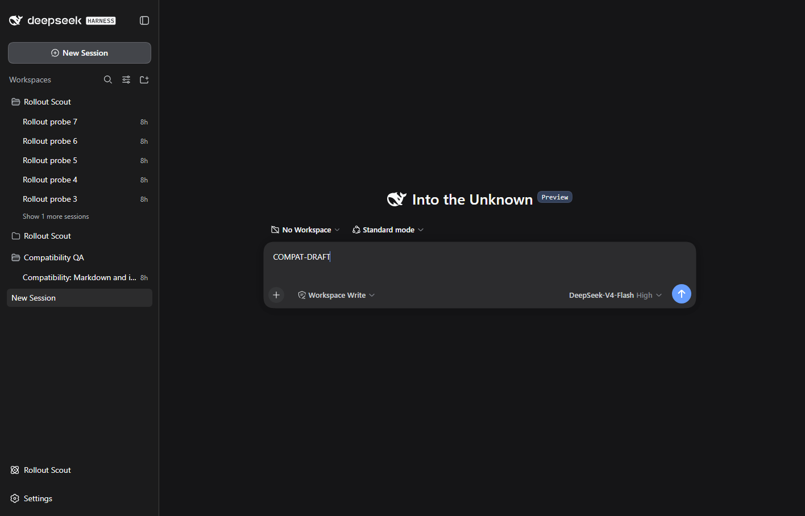

# DSH 0.1.2-rc.1 compatibility

Reviewed on 2026-09-07; npm latest and next both resolve to 0.1.2-rc.1.

The client now declares the session/workspace modules it needs, and newly created blank sessions are materialized before their IDs are returned. Status metadata reads the package version directly. Optional E2E tooling requires one disposable DSH home and the official CLI entry instead of modifying the normal profile.

## Validation

Local unit/loading/persistence tests and npm package checks pass. In official DSH 0.1.2-rc.1 Web, blank creation, workspace attach/detach and persistence after restart pass.

The real DSH checks used a new disposable home, locally generated attachments and an offline model, with all four plugins installed together. No existing user conversations or remote model credentials were used. The isolated server was stopped after checks.

## Browser acceptance

Passed in an isolated Microsoft Edge test process against the official DSH 0.1.2-rc.1 Web runtime. All four plugins were installed together, with synthetic attachments and a local streaming model.

New Session opens a standalone, editable composer with an enabled model selector. The native workspace picker retains a typed draft when entering a workspace and detaching again. A fast follow-up selection waits for the destination session instead of acting on the previous selection.

No application console errors were recorded. The test browser was closed in the runner cleanup.

