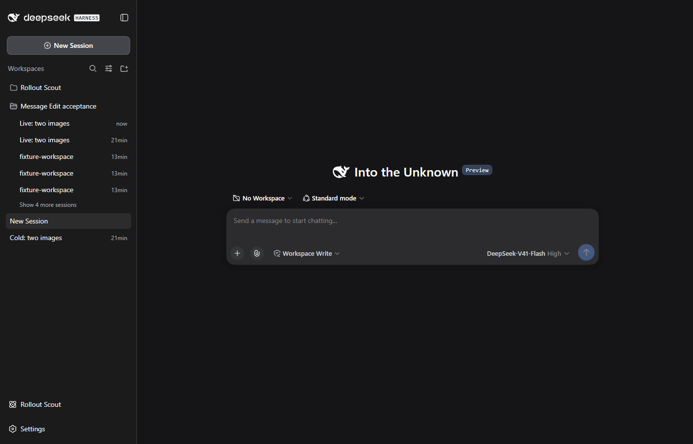

# DSH 0.1.5-rc.2 compatibility

Verified on 2026-09-20 against npm latest/next `0.1.5-rc.2`. The alpha tag is `0.1.6-alpha.2` and is outside this release's declared range.

Create durable standalone chats through the native Session Controller. Adapt sidebar component props instead of cached injection results, including the split workspace sidebar.

## Validation

`npm test` and `npm run check:package` pass.

The real Session Controller creates a durable blank; the detach route removes a test conversation from its workspace. Browser acceptance checks the native New Session button, an editable standalone composer and flat ungrouped rows. Regression tests cover native controller failures, cached sidebar props, and workspace-navigation races.

All four SpookySandwich plugins were loaded together in a separate DSH home using the official published CLI/Web packages, generated images and a deterministic offline model. No remote model service was exercised. Browser runs own and close their separate headless Edge process; user profiles and conversations are not test targets.

