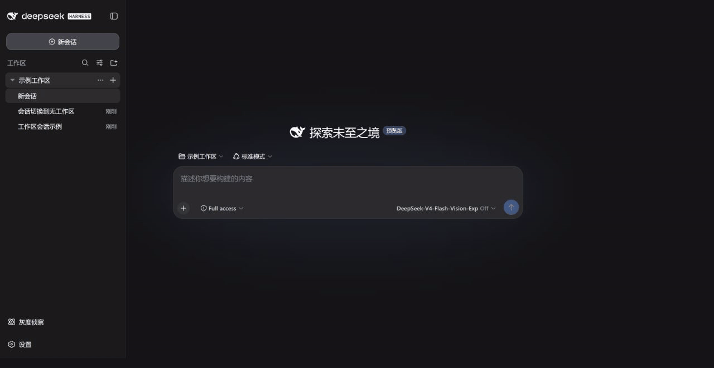

<div align="center">

# No Workspace for DSH

**Let a conversation stand on its own instead of forcing it into a folder.**

English · [简体中文](README.md)

[](https://github.com/SpookySandwich/dsh-plugin-no-workspace/releases/tag/v1.0.0)
[](https://github.com/deepseek-ai/deepseek-harness)
[](#verification)
[](LICENSE)

True first-class workspace-free conversations for DeepSeek Harness, without replacing its native workspace experience.



*Choose “No Workspace”, then collapse the real workspace—the standalone conversation remains directly in the sidebar.*

</div>

## What it fixes

DSH normally places every conversation in a workspace, or renders unassigned conversations under an extra “Ungrouped” folder. This plugin makes “not attached to a workspace” a real first-class state: standalone conversations appear directly in the sidebar, without a synthetic folder and without silently inheriting the active workspace.

| Scenario | With this plugin |
| --- | --- |
| Click the global **New Session** button | Creates a standalone conversation without inheriting a workspace |
| Choose **No Workspace** in the native picker | Detaches the current conversation without losing history |
| Collapse a real workspace | Standalone conversations remain visible at the top level |
| Open an empty standalone conversation | Composer, model picker, attachments, and send are immediately available |
| Use native workspace features | Search, menus, drag-and-drop, sorting, archive, and directory selection remain intact |

## Install

```bash
dsh plugin --profile desktop add dsh-plugin-no-workspace
```

Install from a local checkout or package:

```bash
dsh plugin --profile desktop add ./dsh-plugin-no-workspace
# or
dsh plugin --profile desktop add ./dsh-plugin-no-workspace-1.0.0.tgz
```

Restart DSH after installing or upgrading so both host and client code reload.

## Design principles

- **Keep the native sidebar** — wrap DSH's registered slots instead of replacing navigation.
- **Never invent a folder** — hide only the synthetic “Ungrouped” container; real workspaces retain their native structure.
- **Preserve conversation data** — detaching updates only workspace indexes, keeping events, drafts, and context intact.
- **Use a neutral working directory** — new standalone conversations start from the user's home directory.
- **Respect the current language** — the UI follows DSH with “No Workspace” or “无工作区”.

## How it works

The host adds small endpoints for standalone creation and lossless detaching. The client changes only three behaviors: global session creation, the composer gate for standalone sessions, and the native workspace picker. Icons, disclosure arrows, menu placement, and session rows continue to use DSH's native layout and interactions.

## Verification

```bash
npm test
npm run test:e2e
```

The suite covers 88 unit and robustness cases plus real DSH desktop-profile flows for standalone creation, composer and model access, workspace switching, draft migration, detaching, flattened sidebar rendering, and native menu behavior. E2E cleanup restores the workspace store and removes only test-created sessions.

## Compatibility

Verified against DSH `0.1.1-rc.2`. It coexists with client plugins including `dsh-plugin-message-edit`, `dsh-plugin-marginalia`, and `dsh-plugin-rollout-scout`.

## License

[MIT](LICENSE) © SpookySandwich
