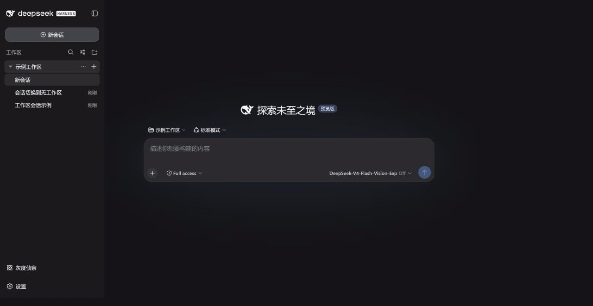

<div align="center">

# No Workspace for DSH

**让会话保持独立，而不是被迫塞进一个文件夹。**

[English](README.en.md) · 简体中文

[](https://www.npmjs.com/package/dsh-plugin-no-workspace)
[](https://github.com/SpookySandwich/dsh-plugin-no-workspace/actions/workflows/ci.yml)
[](https://github.com/SpookySandwich/dsh-plugin-no-workspace/releases/latest)
[](https://github.com/deepseek-ai/deepseek-harness)
[](LICENSE)

为 DeepSeek Harness 添加真正的一等「无工作区」会话，同时保留原生工作区体验。



*从工作区中选择「无工作区」；即使随后收起工作区，独立会话仍直接显示在侧边栏。*

</div>

## 它解决什么

DSH 原本会把每个会话放进工作区，或显示在一个额外的「未分组」文件夹中。这个插件把“未绑定工作区”变成真正的一等状态：独立会话直接出现在侧边栏，不显示虚构的「未分组」目录，也不会偷偷继承当前工作区。

| 场景 | 安装后 |
| --- | --- |
| 点击顶部「新建会话」或窗口标题栏的新建按钮 | 创建独立会话，不继承当前或最近使用的工作区 |
| 按下「新建会话」快捷键 | 同样创建独立会话，并跟随你在设置中改绑的按键 |
| 在工作区选择器中选择「无工作区」 | 将当前会话无损移出工作区 |
| 收起真实工作区 | 独立会话仍作为一级会话显示 |
| 打开独立空白会话 | 输入、模型选择、附件与发送立即可用 |
| 使用原生工作区功能 | 搜索、菜单、拖放、排序、归档和目录选择保持不变 |

## 安装

```bash
dsh plugin --profile desktop add dsh-plugin-no-workspace
```

从本地源码或打包文件安装：

```bash
dsh plugin --profile desktop add ./dsh-plugin-no-workspace
# 或
dsh plugin --profile desktop add ./dsh-plugin-no-workspace-1.2.0.tgz
```

安装或升级后重启 DSH，使宿主端和客户端代码同时重新加载。

## 设计原则

- **不替换原生侧边栏**：插件包装 DSH 已注册的槽位，而不是重写整套导航。
- **不伪造文件夹**：只隐藏独立会话外层的「未分组」容器；真实工作区仍保留原生文件夹结构。
- **不损坏历史**：解绑只更新工作区会话索引，完整保留会话事件、草稿与上下文。
- **不污染执行目录**：新独立会话使用用户主目录作为中性的执行目录。
- **不破坏语言体验**：界面随 DSH 显示「无工作区」或 “No Workspace”。

## 工作方式

宿主端提供创建独立会话和无损解绑的轻量路由；客户端只改变新建会话的每个入口（侧边栏、窗口标题栏控件、可改绑的快捷键）、独立会话的 composer 门禁，以及原生工作区选择器。图标、箭头、菜单定位和会话行继续沿用 DSH 的原生布局与交互。

## 验证

```bash
npm ci
npm test
npm run check:package
```

测试覆盖单元与健壮性用例、新版客户端依赖和会话持久化。可选 `npm run test:e2e` 需要先创建系统临时目录下的 `dsh-no-workspace-e2e-*` 测试目录，将 `DSH_HOME` 指向它，并设置 `DSH_CLI_ENTRY` 为官方 `@deepseek-ai/dsh/lib/bin.js` 路径。测试 profile 需单独安装本插件；脚本拒绝操作日常使用的 DSH 目录。

## 兼容性

版本 `1.2.0`：适配 DSH `0.2.0-rc.2`。窗口标题栏的新建按钮（`shell.leading`）与可重绑定的「新建会话」快捷键都被纳入独立会话路径；同时确认此前的公开契约未发生破坏性变更。

声明兼容范围为 `>=0.1.5-rc.2 <0.1.6-0 || ^0.2.0-rc.1`：前一段与 `1.1.0` 逐字相同，原先已被接纳的宿主一个都不少；后一段新增 `0.2.0-rc.1` 及之后的 `0.2.x` 预发布版本。不声明兼容 `0.3.0` 或 `0.1.6` alpha。预发布版本要求比较器显式列出同一元组，所以这里是追加一个 OR 分支，而不是放大上界——`>=0.1.5-rc.2 <0.3.0-0` 这类写法在 npm 默认语义下同样够不到 `0.2.0-rc.2`。[验证记录](.github/reviews/dsh-0.2.0.md)。

可从 [GitHub Release](https://github.com/SpookySandwich/dsh-plugin-no-workspace/releases/tag/v1.2.0) 下载发布包，然后执行 `dsh plugin --profile desktop add ./dsh-plugin-no-workspace-1.2.0.tgz`。

本次兼容目标为 DSH `0.2.0-rc.2`。运行 `npm ci`、`npm test` 和 `npm run check:package` 可验证构建及发布包。更新后请重启 DSH。


已适配 DSH `0.2.0-rc.2`。本次为源码级逐包比对与自动化回归测试；真实桌面/浏览器运行时的验收项见验证记录中的「未执行」清单。

## License

[MIT](LICENSE) © SpookySandwich
